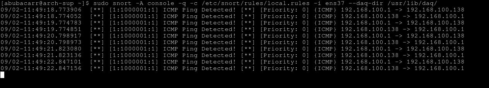
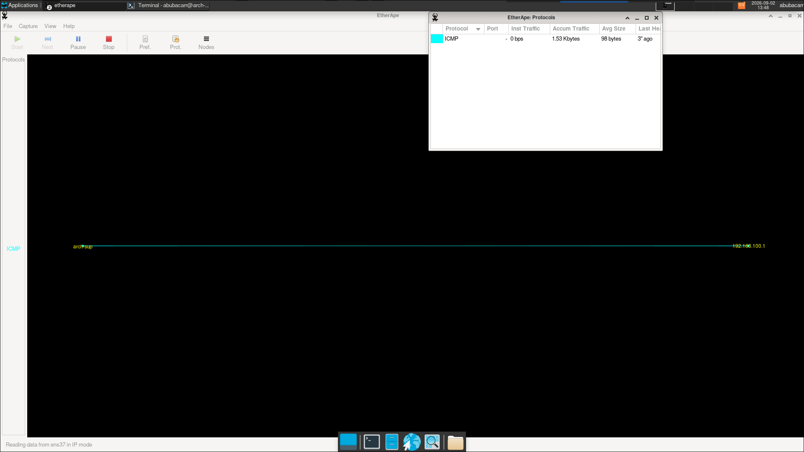
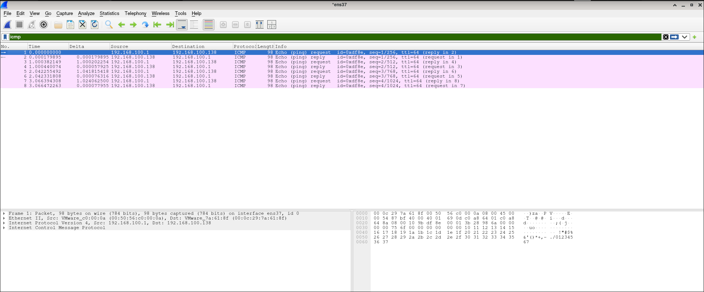

# Network Intrusion Detection System (NIDS)

## Project Overview
A hands-on NIDS project built with Snort on Arch Linux, with live visualization via EtherApe and packet analysis in Wireshark.

**Task:** Network Intrusion Detection System (NIDS)  

---

## Tools Used

| Tool | Purpose |
|------|---------|
| **Snort** | Intrusion detection engine |
| **EtherApe** | Real-time network traffic visualization |
| **Wireshark** | Packet sniffing and analysis |
| **Arch Linux** | Operating system (VM) |

---

## Phase 1: Preconfiguration

### Step 1: System Information
Fetched detailed information about the system using `fastfetch` to display OS, IP address, storage, memory usage, and more:

```bash
fastfetch
```
**System Details:**
```text
OS: Arch Linux
IP Address: 192.168.100.138
Interface: ens37
```

### Step 2: System Update
Updated the system package repositories and installed packages:
```bash
sudo pacman -Syu
```
Ran the same command again to ensure no remaining updates were pending.

## Phase 2: Snort Installation & Configuration

### Step 1: Installing Snort
Installed Snort using Arch's package manager:
```bash
sudo pacman -S snort
```


**Warning Encountered:**
During installation, I noticed a warning stating:
```text
snort's uid 29 is out of the UID_MIN 1000 and UID_MAX 6000 range
```


**Fix Applied:**
I changed the default UID from 29 to a custom UID 1111 (within the allowed range) using:

```bash
sudo usermod -u 1111 snort
id snort
```
Output confirmed the new UID assignment.


### Step 2: Verify Snort Installation
Confirmed Snort was installed successfully:
```bash
snort --version
```


### Step 3: Identify Network Interface
Checked the IP address and interfaces using:
```bash
ip a
```


**Findings:**
```text
IP Address: 192.168.100.138
Interface: ens37
```

### Step 4: Configure Snort
Edited the `snort.conf` file with root privileges using Neovim:
```bash
sudo nvim /etc/snort/snort.conf
```


**Change Made:**
Updated the default `HOME_NET` from `any` to my specific network:
```text
var HOME_NET 192.168.100.0/24
```

### Step 5: Create Custom Rule
Navigated to the rules folder and created my own custom rule file:
```bash
cd /etc/snort/rules
sudo nvim local.rules
```

**Custom Rule Added:**
```text
alert icmp any any -> any any (msg:"ICMP Ping Detected!"; sid:1000001; rev:1;)
```

This rule alerts Snort to detect any ICMP packets (e.g., ping traffic) from any source to any destination.

## Phase 3: Testing Snort

### Step 1: Run Snort in Alert Mode
Ran Snort using my custom rule file and specified the interface to monitor:
```bash
sudo snort -A console -q -c /etc/snort/rules/local.rules -i ens37
```
[!Note]: Snort is now actively listening on interface ens37.

### Step 2: Generate Traffic
From my host OS, sent 4 ICMP echo requests (pings) to the Arch VM:
```bash
ping -c 4 192.168.100.138
```

### Step 3: Observe Alerts
On the Arch VM terminal, Snort displayed alerts showing:
```text
[**] [1:1000001:1] ICMP Ping Detected! [**]
```

**The alert included:**
    **Source IP**,
    **Destination IP**,
    **Protocol type (ICMP)**,etc.

Snort successfully detected the ICMP traffic!

## Phase 4: EtherApe Dashboard

### Step 1: Install EtherApe
Installed EtherApe, a lightweight graphical network monitor that draws a live graph of network traffic:
```bash
sudo pacman -S etherape
etherape --version
```

### Step 2: Run EtherApe
Launched EtherApe with the specific interface to monitor:
```bash 
sudo etherape -i ens37
```
**A graphical window appeared with floating nodes (bubbles) and lines showing active connections between IPs.**

### Step 3: Visualize Traffic
When I pinged the Arch VM from my host OS, EtherApe displayed:
**Graph/dashboard showing connections between:**
    **`Arch VM IP: 192.168.100.138`**
    **`Host IP: 192.168.100.1**`
**Lines indicating active ICMP traffic**
**Protocol information**

**Observation**: With minimal traffic, only one connection was visible. When browsing the web, EtherApe showed many more connections.

**EtherApe successfully visualized the network activity!**

## Phase 5: Wireshark Packet Analysis

### Step 1: Run Wireshark
Launched Wireshark from the terminal with root privileges:
```bash
sudo wireshark
```

### Step 2: Capture Traffic
Selected the interface `ens37` and started packet capture.

### Step 3: Analyze Packets
**8 packets total:**
    4 Echo Request packets
    4 Echo Reply packets

**Wireshark confirmed successful ICMP packet exchange!**

---
Screenshots
<p align="center">
  
  <figcaption><i>snort_alert.png: snort detecting icmp traffic and sending alerts.</i></figcaption>
</p>

---

<p align="center">
  
  <figcaption><i>etherape_graph.png: etherape showing active connections.</i></figcaption>
</p>

---

<p align="center">
  
  <figcaption><i>wireshark_capture.png: wireshark filtered to capture icmp traffic.</i></figcaption>
</p>

---

|### Key Learnings|
|------------------|
|**1. Snort Configuration**: Learned to customize snort.conf and create custom rule files.|
|**2. User Management**: Encountered and resolved a UID range issue during installation.|
|**3. Traffic Generation**: Successfully generated and detected ICMP traffic.|
|**4. Visualization**: Used EtherApe for real-time graph visualization.|
|**5. Packet Analysis**: Used Wireshark to verify packet details.|

---

https://lnkd.in/p/eQkF__Gt
